# Nirmalya Pal

  

  <strong>Computer Science · Software Engineering · Speech & AI Research</strong>

  Building software and exploring intelligent systems.

  <a href="https://linkedin.com/in/nirmalya-pal-2004">LinkedIn</a>
  ·
  <a href="https://github.com/spexterxd">GitHub</a>
  ·
  <a href="https://leetcode.com/spexterxd">LeetCode</a>

---

## About

  

I am a Computer Science undergraduate focused on **software engineering,
machine learning, and speech AI**.

My work sits at the intersection of building practical software and
exploring intelligent systems, with a particular interest in **speech,
language, and deep learning**.

I currently work as a **Research Intern at IIT Kharagpur**, exploring
speech biomarker models and questions surrounding accent and speaker
diversity.

Previously, I worked on **automatic speech recognition**, exploring
end-to-end speech pipelines and deep learning approaches.

I enjoy taking ideas from exploration to implementation and continuously
improving my knowledge.

---

## Experience

  

### Research Intern · IIT Kharagpur

**Worked here — Jul 2026 to Present**

_Mitigating Accent Bias in Speech Biomarkers using Voice Conversion Augmentation_

Exploring speech biomarker models with an emphasis on accent-related
variation and speaker diversity.

---

### Research Intern · IIT Kharagpur

**Worked here — Aug 2025 to Oct 2025**

_ASR Methods Based on Deep Learning Approaches_

Worked on automatic speech recognition and explored deep learning-based
approaches for speech processing.

---

## Research

  

My research interests span across **speech AI, deep learning, representation
learning, and bias in intelligent systems**.

I am particularly interested in how speech-based models behave across
different speakers and conditions, and in approaches that improve their
robustness and reliability.
---

## Toolkit

  

<table width="90%">
<tr>
<td align="center" width="24%"><strong>Languages</strong></td>
<td align="center">C · C++ · Python · JavaScript · TypeScript · SQL</td>
</tr>

<tr>
<td align="center"><strong>Web & Backend</strong></td>
<td align="center">React · Next.js · Node.js · Express · REST APIs · WebRTC</td>
</tr>

<tr>
<td align="center"><strong>Data</strong></td>
<td align="center">PostgreSQL · MongoDB · Prisma</td>
</tr>

<tr>
<td align="center"><strong>AI & ML</strong></td>
<td align="center">PyTorch · Transformers · NLP · ASR · Deep Learning · Model Optimization</td>
</tr>

<tr>
<td align="center"><strong>Infrastructure</strong></td>
<td align="center">Docker · Git · GitHub · Postman</td>
</tr>
</table>

---

  

  learning · building · improving

