# Nirmalya Pal

<p align="center">
  
</p>

<p align="center">
  <strong>Computer Science · Software Engineering · Speech & AI Research</strong>
</p>

<p align="center">
  Building software and exploring intelligent systems.
</p>

<p align="center">
  <a href="https://linkedin.com/in/nirmalya-pal-2004">LinkedIn</a>
  ·
  <a href="https://github.com/spexterxd">GitHub</a>
  ·
  <a href="https://leetcode.com/spexterxd">LeetCode</a>
  ·
  <a href="https://scholar.google.com/citations?user=aa9F2dAAAAAJ&hl=en">Scholar</a>
  ·
  <a href="mailto:nirmalya03561@gmail.com">Email</a>
</p>

<br>

```text
┌──────────────────────────────────────────────────────────────┐
│                                                              │
│   software     systems     intelligence     research         │
│                                                              │
│   ────────────────────────────────────────────────────────   │
│                                                              │
│   currently exploring speech, machine learning & full-stack  │
│   engineering through research and things I build.           │
│                                                              │
└──────────────────────────────────────────────────────────────┘
```

---

## About

I am a Computer Science undergraduate interested in the space between
**software engineering and intelligent systems**.

My work moves between building full-stack applications and exploring
machine learning problems, particularly around **speech and language**.

I currently work as a research intern at **IIT Kharagpur**, where I explore
speech biomarker models and questions surrounding accent and speaker
diversity.

Previously, I worked on end-to-end **automatic speech recognition systems**
and experimented with different deep learning architectures for speech.

Outside research, I enjoy turning ideas into working software.

---

## Selected Work

<table>
<tr>
<td width="50%" valign="top">

### Live Streaming Platform

A full-stack real-time streaming application exploring
WebRTC, media infrastructure, authentication, data modelling
and modern application architecture.

<br>

<a href="https://github.com/SpEXterXD/Streaming-SV">Repository</a>
  ·   <a href="https://streaming-sv.vercel.app/">Live</a>

</td>

<td width="50%" valign="top">

### Rizzume

An AI-powered resume analysis application focused on
understanding job descriptions, analysing resumes and
generating contextual feedback.

<br>

<a href="https://github.com/SpEXterXD/Rizzume">Repository</a>
  ·   <a href="https://puter.com/app/spexterxd-rizzume">Live</a>

</td>
</tr>
</table>

---

## Research

```text
speech
  │
  ├── automatic speech recognition
  │
  ├── speech representations
  │
  ├── biomarker modelling
  │
  └── robustness across speakers
```

My current research interests include **speech AI, deep learning,
representation learning, and bias in intelligent systems**.

I have also contributed to academic publications and book chapters
spanning machine learning applications and emerging technologies.

<a href="https://scholar.google.com/citations?user=aa9F2dAAAAAJ&hl=en">
Google Scholar →
</a>

---

## Recognition

**XiBit Hackathon · 2025**
1st Place

**XiBit Hackathon · 2026**
3rd Place

---

## Toolkit

```text
Languages       C · C++ · Python · JavaScript · TypeScript · SQL

Web             React · Next.js · Node.js · Express · REST · WebRTC

Data            PostgreSQL · MongoDB · Prisma

AI              PyTorch · Transformers · NLP · ASR · Deep Learning

Infrastructure  Docker · Git · GitHub · Postman
```

---

<p align="center">
  
</p>

<p align="center">
  <sub>building quietly · learning continuously</sub>
</p>
